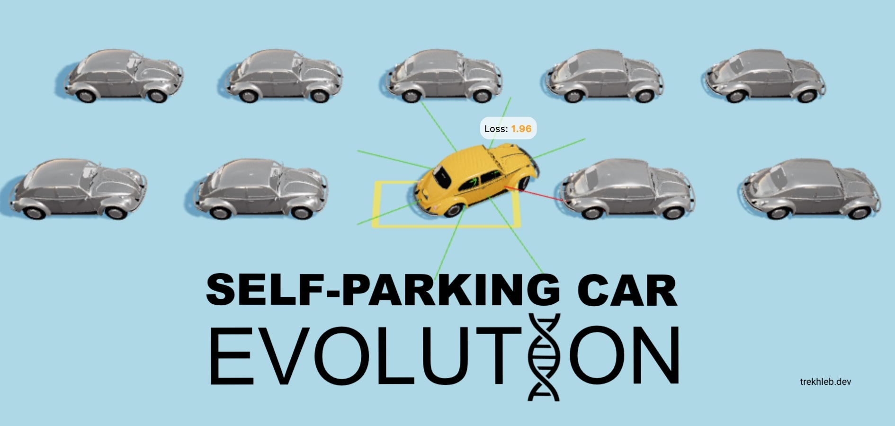

# 🧬 Self-Parking Car Evolution

Training the car to do self-parking using a genetic algorithm.

- 🚕 [Launch the demo](https://trekhleb.dev/self-parking-car-evolution)
- 📃 [Read about how it works](https://trekhleb.dev/blog/2021/self-parking-car-evolution/)

This is an experimental project with the aim to learn the basics of how [genetic algorithm](https://en.wikipedia.org/wiki/Genetic_algorithm) works by teaching the cars to do the self-parking. The evolution process is happening directly in the browser. You may check the [evolution source-code](https://github.com/trekhleb/self-parking-car-evolution/tree/master/src/libs) (in TypeScript) or read the [explanation of how it works](https://trekhleb.dev/blog/2021/self-parking-car-evolution/) in my blog-post.

**At the beginning of the evolution** the cars behave like this:

**In 40th generation** the cars start learning what the self-parking is:

Another example with a bit more challenging starting point:

Hints:

- Use `?debug=true` URL param to see the FPS performance monitor and debugging logs.
- Training progress is being saved to local storage.
- Use `npm run test` to run all tests or `npm run test -- 'test-name'` to run a specific test.
- To run the dev build, run `npm run start`, then the app will be served on `http://localhost:3000`
- To test a production build, run `npm run build` and then run `npx serve build`, then the app will be served on `http://localhost:5000`
- [Pre-trained checkpoints](https://github.com/trekhleb/self-parking-car-evolution/tree/master/src/checkpoints)
